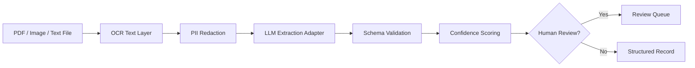

# Document Intelligence LLM Pipeline

OCR + LLM extraction pipeline for converting unstructured documents into
validated structured records.

This project demonstrates production-minded document AI patterns: OCR text
normalization, PII redaction, schema extraction, confidence scoring, validation,
and human-review routing.

## Business Problem

Enterprise teams often receive PDFs, scans, emails, and images that must be
converted into structured records. Manual extraction is slow and error-prone.
This repository demonstrates a safe, testable pipeline pattern for OCR + LLM
document extraction.

## Architecture



## Tech Stack

- Python 3.10+
- OCR adapter pattern
- LLM extraction adapter pattern
- Pydantic-ready schema validation design
- Unit tests with `unittest`

## Quick Start

```bash
python -m src.demo
python -m unittest discover -s tests
```

## Production Extensions

- Azure AI Document Intelligence OCR
- Azure OpenAI / GPT extraction
- Blob Storage ingestion
- Service Bus event processing
- Case creation API integration
