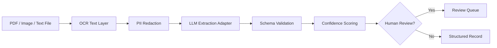

# Document Intelligence LLM Pipeline

OCR + LLM extraction pipeline for converting unstructured documents into
validated structured records.

This project demonstrates production-minded document AI patterns: OCR text
normalization, PII redaction, schema extraction, confidence scoring, validation,
and human-review routing.

## Business Problem

Enterprise teams often receive PDFs, scans, emails, and images that must be
converted into structured records. Manual extraction is slow and error-prone.
This repository demonstrates a safe, testable pipeline pattern for OCR + LLM
document extraction.

## Architecture Decisions and Tradeoffs

- **Decision:** Separate OCR normalization, PII redaction, extraction, schema
  validation, confidence scoring, and review routing.
- **Tradeoff:** Multiple stages add orchestration overhead, but each stage becomes
  testable, observable, and replaceable.
- **Expected scale:** Designed for batch and queue-based processing where large
  document backlogs can be handled without blocking validation or review.
- **Cost strategy:** Cache OCR results by checksum and use deterministic
  extraction before invoking more expensive LLM workflows.
- **Security strategy:** Mask sensitive data before logs/prompts and restrict raw
  artifact access to approved roles.
- **Operational strategy:** Monitor OCR failures, schema validation errors,
  confidence distribution, review rate, and per-document latency.
- **Lessons learned:** Extraction systems need schema validation and review loops,
  not only prompt instructions.

## Architecture



## Tech Stack

- Python 3.10+
- OCR adapter pattern
- LLM extraction adapter pattern
- Pydantic-ready schema validation design
- Unit tests with `unittest`

## Quick Start

```bash
python -m src.demo
python -m unittest discover -s tests
docker compose up --build
```

## Included POC Code

- OCR text normalization and PII redaction
- Regex-backed local extraction adapter for requester, reference ID, and amount
- Confidence scoring and schema validation gates
- Human-review routing for unclear or low-confidence documents
- Sample OCR input in `examples/sample_ocr_text.txt`

## Engineering Maturity

- Dockerfile and `docker-compose.yml` for local execution
- GitHub Actions workflow for unit tests
- `.env.example` for safe configuration hygiene
- Production readiness notes in `docs/production-readiness.md`
- Security, monitoring, cost, and scalability considerations documented

## Production Extensions

- Azure AI Document Intelligence OCR
- Azure OpenAI / GPT extraction
- Blob Storage ingestion
- Service Bus event processing
- Case creation API integration

## Deep Dive

See [docs/deep-dive.md](docs/deep-dive.md) for OCR comparison, chunking and
metadata strategy, confidence scoring, extraction validation, human review,
document classification, table/entity extraction, and benchmark guidance.
