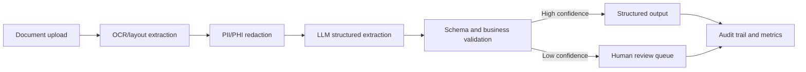

# Architecture Overview

This repository demonstrates a sanitized OCR + LLM extraction workflow for document intelligence scenarios.

## Pipeline Stages

- OCR/layout extraction converts files into normalized text blocks.
- Redaction removes sensitive values before downstream LLM processing.
- Extraction maps text into a typed schema.
- Validation checks required fields, confidence, and business constraints.
- Review routing catches uncertain or incomplete outputs.

## Production Extension Points

- Azure AI Document Intelligence for OCR and layout.
- Azure OpenAI or approved open-source LLM for extraction.
- Blob Storage for raw/sanitized artifacts.
- Service Bus or queue processing for asynchronous workflows.
- Review UI for low-confidence cases and exception handling.
