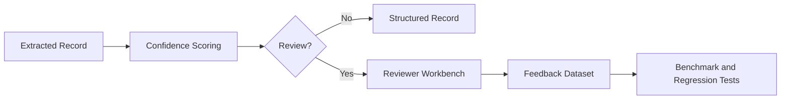

# Document Intelligence Deep Dive

## OCR Comparison

| Approach | Strength | Tradeoff |
| --- | --- | --- |
| Local text extraction | Fast and low cost | Weak for scans and images |
| Managed OCR | Layout and handwriting support | Higher cost and provider dependency |
| Template extraction | Strong for fixed forms | Fragile with layout drift |
| LLM-assisted extraction | Flexible for unstructured docs | Requires validation and review gates |

## Chunking Strategy

- Use document structure where available: sections, tables, pages, headings.
- Preserve metadata: document type, page number, source URI, tenant, sensitivity.
- Avoid chunks so large that citations become vague.
- Evaluate chunk changes with benchmark questions.

## Metadata Strategy

Required metadata:

- `document_id`
- `source_uri`
- `page_number`
- `document_type`
- `tenant_id`
- `sensitivity_level`
- `extraction_schema_version`

## Confidence Scoring

Confidence should combine:

- OCR quality
- Field presence
- Schema validity
- Source-span support
- Business rule consistency
- Historical review feedback

## Extraction Validation

- Validate required fields.
- Validate format and allowed values.
- Validate field-level source references.
- Route low-confidence or inconsistent records to review.

## Human Review Workflow

## Document Classification

Use deterministic signals first:

- Keywords and headers
- File source
- Attachment name
- Layout markers

Use model classification when deterministic signals are weak.

## Table Extraction

- Preserve row/column coordinates where available.
- Validate numeric fields and totals.
- Route merged-cell or low-confidence tables to review.

## Entity Extraction

Core entity types:

- Requester
- Reference ID
- Amount
- Date
- Case type
- Policy or claim ID

## Synthetic Benchmark Results

The current repository includes deterministic local tests rather than fake
production benchmarks. A production benchmark should track:

- Field-level precision and recall
- Review overturn rate
- OCR failure rate
- Confidence calibration
- Latency by document type
- Cost per processed page

## What Changes at 10x Scale?

- Queue by document type and priority.
- Cache OCR by checksum.
- Add batch OCR jobs.
- Store review feedback as an evaluation dataset.
- Introduce tenant-aware storage and retrieval policies.
